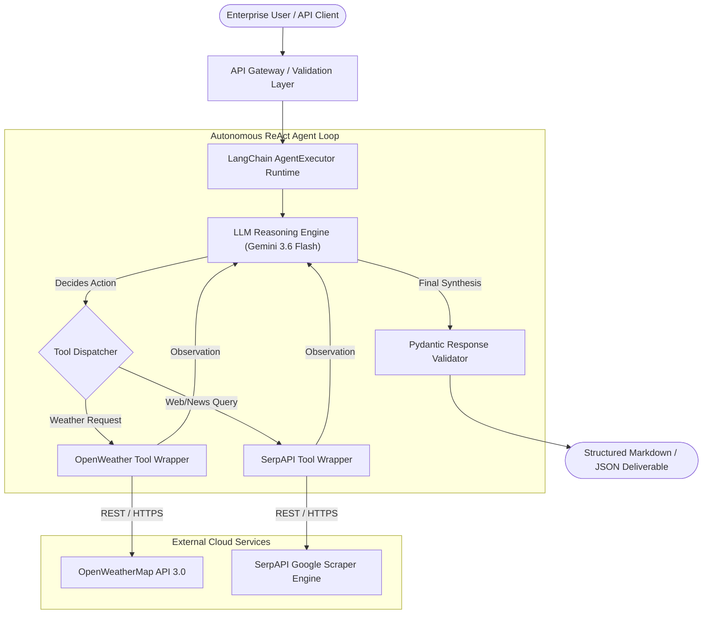
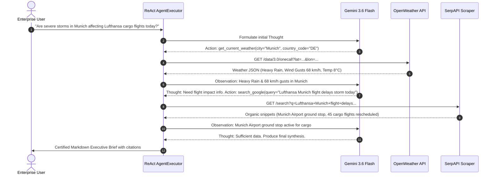

# Production System Architecture & Design Document: Weather-Augmented Intelligence & Search Agent (WAIS-Agent)

**System Name:** Weather-Augmented Intelligence & Search Agent (WAIS-Agent)  
**Version:** 2.1.0  
**Status:** Approved for Implementation  
**Target Environment:** Python 3.12+, LangChain 1.x / LangGraph, Google Gemini 3.6 Flash (`gemini-3.6-flash`)  
**External Services:** OpenWeatherMap One Call API 3.0, SerpAPI (Google Search Engine Scraper)

---

## 1. Project Overview & System Architecture

### 1.1 Executive Summary
The **Weather-Augmented Intelligence & Search Agent (WAIS-Agent)** is an autonomous enterprise AI agent designed to synthesize hyper-local atmospheric conditions with real-time web intelligence. Built on the **ReAct (Reasoning + Acting)** framework, the agent dynamically determines when physical environmental data (from OpenWeather API) intersects with real-time news, flight cancellations, logistical disruptions, or event advisories (from SerpAPI) to produce actionable executive briefs.

### 1.2 System Architecture Diagram



### 1.3 End-to-End Sequence Diagram



---

## 2. Pydantic Data Contracts & Schemas

To ensure strict type-safety, fail-fast schema validation, and deterministic output serialization, all payloads entering and leaving the agent must adhere to explicit Pydantic v2 schemas.

### 2.1 User Request Payload Contract
```python
from typing import Literal, Optional, List
from pydantic import BaseModel, Field

class AgentRequestPayload(BaseModel):
    """Client request ingested by the agent gateway."""
    query: str = Field(
        ...,
        min_length=5,
        max_length=500,
        description="User query requiring weather data, live web search, or cross-domain synthesis."
    )
    user_location_hint: Optional[str] = Field(
        default=None,
        description="Optional ISO city/country context (e.g. 'Munich, DE') to resolve ambiguous queries."
    )
    response_mode: Literal["executive_brief", "raw_data", "actionable_bulletins"] = Field(
        default="executive_brief",
        description="Formatting profile for the final response."
    )
    temperature_override: Optional[float] = Field(
        default=0.0,
        ge=0.0,
        le=1.0,
        description="Sampling temperature for the underlying LLM."
    )
```

### 2.2 Tool Input Schemas

```python
class OpenWeatherInput(BaseModel):
    """Schema for OpenWeather Tool invocation."""
    city: str = Field(
        ...,
        min_length=2,
        description="Target city name (e.g. 'London', 'Tokyo', 'Munich')."
    )
    country_code: Optional[str] = Field(
        default=None,
        min_length=2,
        max_length=3,
        description="Two-letter ISO 3166-1 alpha-2 country code (e.g. 'GB', 'JP', 'DE')."
    )
    units: Literal["standard", "metric", "imperial"] = Field(
        default="metric",
        description="Measurement units: 'metric' (Celsius, m/s), 'imperial' (Fahrenheit, mph)."
    )

class SerpAPIInput(BaseModel):
    """Schema for SerpAPI Google Search Tool invocation."""
    query: str = Field(
        ...,
        min_length=3,
        max_length=200,
        description="Target web search query terms."
    )
    search_type: Literal["search", "news"] = Field(
        default="search",
        description="Google Search engine vertical: general 'search' or live 'news'."
    )
    num_results: int = Field(
        default=5,
        ge=1,
        le=10,
        description="Number of organic result snippets to retrieve."
    )
```

### 2.3 Agent Final Output Contract

```python
class WeatherSnapshot(BaseModel):
    city: str
    temperature: float
    unit: str
    condition_description: str
    humidity_pct: int
    wind_speed: float
    alert_banner: Optional[str] = None

class SearchCitation(BaseModel):
    title: str
    source_domain: str
    url: str
    snippet: str

class AgentResponseContract(BaseModel):
    """Certified final payload emitted by the agent."""
    executive_summary: str = Field(..., description="High-level synthesis of findings.")
    weather_data: Optional[WeatherSnapshot] = Field(None, description="Extracted physical atmospheric metrics.")
    web_intelligence: List[SearchCitation] = Field(default_factory=list, description="Validated web citations.")
    risk_assessment: Literal["LOW", "MODERATE", "ELEVATED", "CRITICAL"] = Field(
        ...,
        description="Computed operational risk level."
    )
    actionable_recommendations: List[str] = Field(..., description="Actionable next steps for enterprise stakeholders.")
    timestamp_utc: str = Field(..., description="ISO 8601 UTC execution timestamp.")
```

---

## 3. Tool Specifications

### 3.1 Tool 1: OpenWeather API Wrapper (`fetch_current_weather`)

| Attribute | Specification |
| :--- | :--- |
| **Tool Identifier** | `fetch_current_weather` |
| **API Endpoint** | `https://api.openweathermap.org/data/2.5/weather` |
| **HTTP Method** | `GET` |
| **Authentication** | Query parameter `appid={OPENWEATHER_API_KEY}` |
| **Input Arguments** | `city` (str), `country_code` (Optional[str]), `units` (Literal['metric', 'imperial']) |
| **Rate Limit** | 60 calls/min (Free Tier), 1,000 calls/day (One Call) |
| **Caching Policy** | 10-minute in-memory LRU cache keyed on `(city.lower(), country_code)` |

#### HTTP Request Pattern:
```http
GET /data/2.5/weather?q=Munich,DE&units=metric&appid={{OPENWEATHER_API_KEY}} HTTP/1.1
Host: api.openweathermap.org
Accept: application/json
```

#### Sanitized Tool Return Format:
```text
[OpenWeather Real-Time Data]
City: Munich, DE | Coordinates: (48.1351, 11.5820)
Conditions: Heavy Rain (Thunderstorm advisory)
Temperature: 8.4°C (Feels like 5.1°C)
Humidity: 92% | Pressure: 998 hPa
Wind: 18.8 m/s (Gusts up to 26.4 m/s ~ 95 km/h)
Visibility: 4,200 meters
```

#### Error Response Handling:
- `401 Unauthorized`: Triggers `ToolException("OpenWeatherAuthError: Invalid API Key. Fallback to historical climate model.")`
- `404 Not Found`: Triggers `ToolException("CityNotFoundError: Location '{city}' not recognized. Re-verify spelling.")`
- `429 Too Many Requests`: Triggers exponential backoff retry; if unrecovered, raises `ToolException("RateLimitError: Quota exceeded.")`

---

### 3.2 Tool 2: SerpAPI Scraper Wrapper (`search_live_web_intelligence`)

| Attribute | Specification |
| :--- | :--- |
| **Tool Identifier** | `search_live_web_intelligence` |
| **API Endpoint** | `https://serpapi.com/search` |
| **HTTP Method** | `GET` |
| **Authentication** | Query parameter `api_key={SERPAPI_API_KEY}` |
| **Input Arguments** | `query` (str), `search_type` (Literal['search', 'news']), `num_results` (int) |
| **Rate Limit** | 100 queries/month (Free), 5,000 queries/month (Production) |
| **Caching Policy** | 15-minute in-memory LRU cache keyed on `SHA256(query + search_type)` |

#### HTTP Request Pattern:
```http
GET /search.json?engine=google&q=Munich+airport+cargo+flight+delays&tbm=nws&num=5&api_key={{SERPAPI_API_KEY}} HTTP/1.1
Host: serpapi.com
Accept: application/json
```

#### Sanitized Tool Return Format:
```text
[SerpAPI Intelligence Feed: 3 results]
1. [Reuters] "Munich Airport Halts Evening Cargo Departures Amid Gale-Force Winds"
   Snippet: Flight operations at Munich Franz Josef Strauss Airport experienced widespread ground stops...
   URL: https://reuters.com/world/europe/munich-airport-storm-delays-2026

2. [Aviation Daily] "Lufthansa Cargo Activates Severe Weather Rerouting Protocols"
   Snippet: Air freight shipments inbound to Southern Germany are being diverted to Frankfurt and Leipzig...
   URL: https://aviationdaily.com/freight/lufthansa-munich-reroute
```

---

## 4. Agent Configuration & Prompt Guardrails

### 4.1 ReAct Loop Control Parameters

```python
AGENT_CONFIG = {
    "model_name": "gemini-3.6-flash",
    "temperature": 0.0,
    "max_iterations": 6,                    # Hard stop to prevent runaway loops
    "max_execution_time_seconds": 30.0,     # Timeout budget per query
    "early_stopping_method": "generate",    # If max iterations hit, synthesize best available data
    "handle_parsing_errors": True,          # Self-healing output parsing
    "verbose": True                         # Detailed tracing of Thought/Action/Observation
}
```

### 4.2 System Prompt & Guardrails Template

```text
You are WAIS-Agent (Weather-Augmented Intelligence & Search Agent), an elite operational intelligence agent at Honra Global Logistics.
Your task is to analyze real-world physical environmental hazards and their downstream commercial and logistical impacts.

You have access to two certified tools:
1. `fetch_current_weather`: Retrieves real-time meteorological metrics (temperature, precipitation, wind, visibility).
2. `search_live_web_intelligence`: Scrapes real-time Google search and news results for events, flight disruptions, or supply chain impacts.

OPERATIONAL GUARDRAILS:
1. Grounding Mandate: You must NEVER invent temperature, wind speed, or flight status metrics. Every claim must originate from tool observations.
2. Tool Specialization:
   - For queries asking about weather, temperature, rain, snow, or wind: ALWAYS invoke `fetch_current_weather` first.
   - For queries asking about news, flights, road closures, or business consequences: invoke `search_live_web_intelligence`.
3. Synthesis Protocol:
   - Connect the physical weather data directly with the web intelligence (e.g. "Because wind gusts exceed 90 km/h, the airport instituted the ground stop reported by Reuters").
4. Output Schema Compliance:
   - Provide a final answer structured with clear markdown sections:
     - ### Executive Overview
     - ### Atmospheric Metrics Snapshot
     - ### Real-Time Ground Impacts & News
     - ### Risk Assessment (LOW / MODERATE / ELEVATED / CRITICAL)
     - ### Recommended Action Plan
```

---

## 5. Error Handling & Fallback Strategy

In distributed cloud environments, external APIs can degrade, experience rate spikes, or exhaust billing quotas. The agent implements a multi-tier resilience architecture:

```mermaid
flowchart TD
    Req[Tool Call Request] --> Exec{Execute Tool Request}
    Exec -->|Success 200 OK| Cache[Write to In-Memory Cache]
    Cache --> ReturnObs[Return Observation to Agent]

    Exec -->|Timeout / 5xx| Retry[Tenacity: Exponential Backoff (3 Retries)]
    Retry -->|Recovered| ReturnObs
    Retry -->|Failed 3x| FallbackCheck{Is Key Missing or 429?}

    FallbackCheck -->|Yes: 429 / Quota| CacheCheck{Cached Data Exists?}
    CacheCheck -->|Yes| CacheObs["Return Stale Cache with Warning Banner"]
    CacheCheck -->|No| MockFallback["Simulated Data Provider with Diagnostic Banner"]
    
    MockFallback --> ReturnObs
    CacheObs --> ReturnObs
    FallbackCheck -->|No: 404 Not Found| ToolEx["Raise ToolException -> Passed to Agent Scratchpad"]
    ToolEx --> AgentReflect["Agent Reflects & Suggests Corrective Query"]
```

### 5.1 Error Handling Matrix

| Error Condition | Root Cause | Agent Behavior | Fallback / Mitigation |
| :--- | :--- | :--- | :--- |
| **HTTP 401** | Missing/Invalid API Key | Catches exception, sets `handle_tool_error=True` | Returns simulated mock data provider with explicit notice: `"[SANDBOX MODE: Using offline reference model]"` |
| **HTTP 429** | Rate Limit Exceeded | Retries with jitter (1s, 2s, 4s) | If still 429, falls back to in-memory cached observation or instructs LLM to proceed with available web search data. |
| **HTTP 404** | Ambiguous City Name | Throws `ToolException("City 'XYZ' not found")` | ReAct scratchpad reflects on error; LLM re-invokes tool with corrected country code (e.g. `Munich, DE`). |
| **HTTP 504 / Timeout** | Upstream API Latency | Timeout threshold set to 5.0s | Aborts request; LLM alerts user that upstream telemetry is temporarily unavailable. |
| **Parser Crash** | LLM outputs malformed action | `handle_parsing_errors=True` | LangChain prompts LLM: `"Invalid Format: Use Action: ... Action Input: ..."` |

---

## 6. Verification & Acceptance Testing Plan

The verification strategy combines unit tests with mocked responses, integration tests verifying ReAct loops, and latency benchmarks.

### 6.1 Test Suite Matrix

| Test ID | Test Category | Target Component | Description / Assertion |
| :--- | :--- | :--- | :--- |
| **TC-01** | Unit | `OpenWeatherInput` Schema | Asserts valid city strings pass and invalid empty strings raise Pydantic `ValidationError`. |
| **TC-02** | Unit | `fetch_current_weather` Tool | Mocks HTTP 200 payload; asserts temperature, wind, and conditions parse accurately. |
| **TC-03** | Unit | `search_live_web_intelligence` | Mocks SerpAPI JSON payload; asserts snippets and URLs are extracted and truncated cleanly. |
| **TC-04** | Resilience | Error Trapping (`handle_tool_error`) | Simulates HTTP 429 quota exhaustion; verifies `ToolException` is captured without crashing process. |
| **TC-05** | Integration | ReAct Agent Dual-Tool Chaining | Executes query: *"Weather in Tokyo and impact on Haneda bullet trains"*; asserts both tools are called in order. |
| **TC-06** | Acceptance | Zero-Hallucination Audit | Validates that all meteorological figures in the final output match the exact tool observation values. |

### 6.2 Automated Test Execution Command (`pytest`)

```bash
# Run unit and integration test suite with coverage
pytest tests/test_wais_agent.py -v --durations=5 --cov=6-6-spec_driven_devmt
```

---

## 7. Approval & Sign-Off

- **Lead Curriculum & Systems Architect:** Antigravity AI Engineering Team  
- **Approved by:** Honra Tech Technical Steering Committee  
- **Effective Date:** September 2026  
- **Target Implementation Repository:** `honra-python/6-6-6-spec_driven_devmt/`
