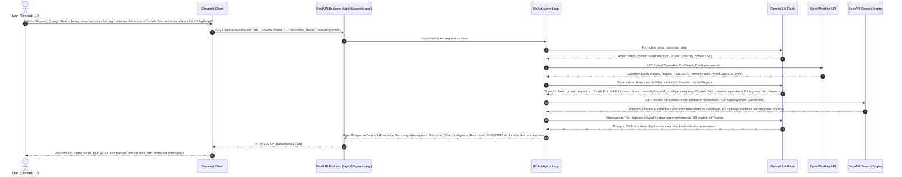

# Production System Architecture & Design Document: Cameroon Weather-Augmented Intelligence & Search Agent (WAIS-Agent)

**System Name:** Cameroon Weather-Augmented Intelligence & Search Agent (WAIS-Agent)  
**Version:** 2.2.0  
**Status:** Approved for Implementation  
**Target Environment:** Python 3.12+, FastAPI, Streamlit, LangChain 1.x / LangGraph, Google Gemini 3.6 Flash (`gemini-3.6-flash`)  
**External Services:** OpenWeatherMap One Call API 3.0, SerpAPI (Google Search Engine Scraper)  
**Target Project Path:** `honra-python/6-spec_driven_devmt/project/weather_and_search_agent`  
**Regional Focus:** Republic of Cameroon (Douala, Yaoundé, Bamenda, Buea, Limbe, Bafoussam, Garoua, Maroua, Kribi, Ngaoundéré, Bertoua)

---

## 1. Project Overview & System Architecture

### 1.1 Executive Summary
The **Cameroon Weather-Augmented Intelligence & Search Agent (WAIS-Agent)** is a production full-stack AI system designed to synthesize hyper-local atmospheric conditions across Cameroon's distinct agro-ecological zones with real-time web intelligence and ground news. Built on a decoupled **Streamlit frontend** and **FastAPI backend** running the **ReAct (Reasoning + Acting)** agent loop with **Google Gemini 3.6 Flash**, the agent empowers logistics coordinators, agricultural planners, transport operators, and disaster management teams to assess real-world weather impacts on Cameroon's critical infrastructure (e.g., Douala Autonomous Port, Kribi Deep Sea Port, the N3 Douala-Yaoundé freight corridor, and northern agro-pastoral hubs).

### 1.2 Target Project Directory Structure

```text
honra-python/6-spec_driven_devmt/project/weather_and_search_agent/
├── backend/
│   ├── main.py                 # FastAPI application server & REST API endpoints
│   ├── agent.py                # LangChain / LangGraph ReAct agent loop (Gemini 3.6 Flash)
│   ├── tools/
│   │   ├── __init__.py
│   │   ├── weather_tool.py     # OpenWeatherMap API wrapper with Cameroon regional caching
│   │   └── search_tool.py      # SerpAPI / DuckDuckGo live news & web search
│   ├── schemas.py              # Pydantic v2 data models (Request, Response, Tool schemas)
│   └── config.py               # App configuration, Cameroon city defaults & env loading
├── frontend/
│   └── app.py                  # Streamlit interactive UI dashboard
├── tests/
│   ├── __init__.py
│   ├── test_agent.py           # ReAct loop & tool invocation tests
│   ├── test_tools.py           # Weather & search tool unit tests
│   └── test_api.py             # FastAPI endpoint integration tests
├── .env.example                # Template for GEMINI_API_KEY, OPENWEATHER_API_KEY, SERPAPI_API_KEY
├── README.md                   # Setup instructions and architectural runbook
└── requirements.txt            # Project dependencies
```

### 1.3 Full-Stack System Architecture Diagram

```mermaid
flowchart TD
    subgraph FrontendTier ["Frontend Tier (Streamlit UI)"]
        User([Student / Logistics / Agro User]) --> UI[Streamlit Dashboard (app.py)]
        UI -->|User Inputs: City, Query, Mode| FormHandler[Streamlit State & Form Handler]
        RenderEngine[KPI Metrics, Risk Badges, Map & Markdown View] -->|Visual Display| User
    end

    subgraph BackendTier ["Backend Tier (FastAPI Server)"]
        FormHandler -->|HTTP POST /api/v1/agent/query| APIGateway[FastAPI Router (main.py)]
        APIGateway --> SchemaValidator[Pydantic v2 Request Validator]
        SchemaValidator --> AgentRunner[ReAct Agent Runtime (agent.py)]
        
        subgraph AutonomousLoop ["ReAct Autonomous Loop"]
            AgentRunner --> LLMBrain["Reasoning Engine (Gemini 3.6 Flash)"]
            LLMBrain -->|Decides Action| ToolRouter{Tool Dispatcher}
            ToolRouter -->|Weather Request| ToolOW[OpenWeather Tool Wrapper]
            ToolRouter -->|News / Local Search| ToolSerp[SerpAPI / Web Search Tool]
            
            ToolOW -->|Atmospheric Metrics| LLMBrain
            ToolSerp -->|Ground Intelligence Snippets| LLMBrain
            LLMBrain -->|Synthesize Final Brief| ResponseFormatter[Pydantic Response Serializer]
        end
        
        ResponseFormatter --> APIResponse[HTTP 200 JSON Payload]
    end

    subgraph CloudServices ["External Cloud Services"]
        ToolOW -->|REST / HTTPS| OWM[OpenWeatherMap API 3.0]
        ToolSerp -->|REST / HTTPS| SERP[SerpAPI Google Search Engine]
    end

    APIResponse --> RenderEngine
```

### 1.4 End-to-End Sequence Diagram (Cameroon Context)



---

## 2. Regional Focus & Cameroon Agro-Ecological Matrix

To provide genuine value to users in Cameroon, the system is pre-configured with regional knowledge bases, coordinates, and operational contexts across Cameroon's 10 administrative regions:

| Region | Major Cities / Hubs | Agro-Ecological Zone | Key Vulnerabilities & Focus Areas |
| :--- | :--- | :--- | :--- |
| **Littoral** | Douala, Edéa, Nkongsamba | Coastal / Equatorial Forest | Douala Autonomous Port (PAD) logistics, Wouri river basin flash flooding, urban drainage, heavy monsoonal rainfall. |
| **Centre** | Yaoundé, Mbalmayo, Bafia | Guinean Equatorial Plateau | N3 Douala-Yaoundé freight corridor, N1 northern corridor, cocoa harvesting advisories, hilly terrain landslides. |
| **South-West** | Buea, Limbe, Kumba | Coastal & Volcanic Highlands | Mount Cameroon microclimates, SONARA refinery logistics, Limbe seaside tourism, palm oil & banana plantations. |
| **North-West** | Bamenda, Kumbo, Ndop | Western Highlands | Vegetable & tuber agricultural basin, high-altitude temperature variations, rural feeder road accessibility during rains. |
| **West** | Bafoussam, Dschang, Foumban | High-Altitude Agricultural Plateau | Coffee & poultry supply chains, food crop market prices, mountainous highway fog and transit safety. |
| **North** | Garoua, Guider, Poli | Sudano-Sahelian Savannah | Bénoué river seasonal flooding, cotton & grain harvesting, Garoua river port conditions, high heat index. |
| **Far-North** | Maroua, Kousséri, Mokolo | Sahelian / Lake Chad Basin | Logone and Chari river seasonal flood alerts, drought monitoring, cross-border trade to N'Djamena (Chad). |
| **South** | Kribi, Ebolowa, Sangmélima | Coastal & Deep Forest | Kribi Deep Sea Port container transit, gas terminal safety, timber transport corridors, maritime weather. |
| **Adamawa** | Ngaoundéré, Meiganga, Tibati | High Plateau Savannah | Cattle & livestock corridor, Camrail railhead cargo transfer station, transitional climate between north and south. |
| **East** | Bertoua, Batouri, Yokadouma | Dense Equatorial Rainforest | Timber supply routes, mining access roads, cross-border humanitarian corridor to Central African Republic (CAR). |

---

## 3. Pydantic Data Contracts & Schemas

All payloads entering FastAPI from Streamlit and leaving the LangChain agent follow strict Pydantic v2 validation contracts.

### 3.1 User Request Payload (`AgentRequestPayload`)
```python
from typing import Literal, Optional, List
from pydantic import BaseModel, Field

class AgentRequestPayload(BaseModel):
    """Client request ingested by the FastAPI backend."""
    query: str = Field(
        ...,
        min_length=5,
        max_length=500,
        description="User query regarding weather conditions, logistics, agriculture, or travel in Cameroon."
    )
    city: str = Field(
        default="Douala",
        description="Target city or region in Cameroon (e.g., Douala, Yaoundé, Bamenda, Buea, Garoua, Maroua, Kribi)."
    )
    country_code: str = Field(
        default="CM",
        description="ISO 3166-1 alpha-2 country code (defaults to 'CM' for Cameroon)."
    )
    response_mode: Literal["executive_brief", "actionable_bulletins", "raw_data"] = Field(
        default="executive_brief",
        description="Desired formatting profile for the final output."
    )
    temperature_override: Optional[float] = Field(
        default=0.0,
        ge=0.0,
        le=1.0,
        description="Sampling temperature for Gemini 3.6 Flash reasoning."
    )
```

### 3.2 Tool Input Schemas
```python
class OpenWeatherInput(BaseModel):
    """Schema for OpenWeather Tool invocation."""
    city: str = Field(
        ...,
        min_length=2,
        description="Target city name in Cameroon (e.g. 'Douala', 'Yaounde', 'Bamenda', 'Buea', 'Garoua', 'Maroua', 'Kribi')."
    )
    country_code: Optional[str] = Field(
        default="CM",
        description="Two-letter country code (defaults to 'CM')."
    )
    units: Literal["metric", "imperial"] = Field(
        default="metric",
        description="Measurement units: 'metric' (Celsius, m/s) standard for Cameroon."
    )

class SerpAPIInput(BaseModel):
    """Schema for SerpAPI / Web Search Tool invocation."""
    query: str = Field(
        ...,
        min_length=3,
        max_length=250,
        description="Target search query with Cameroon local context."
    )
    search_type: Literal["search", "news"] = Field(
        default="news",
        description="Search vertical: live 'news' or general 'search'."
    )
    num_results: int = Field(
        default=5,
        ge=1,
        le=10,
        description="Number of organic result snippets to retrieve."
    )
```

### 3.3 Agent Final Output Contract (`AgentResponseContract`)
```python
class WeatherSnapshot(BaseModel):
    city: str
    region: Optional[str] = None
    temperature_celsius: float
    feels_like_celsius: float
    condition_description: str
    humidity_pct: int
    wind_speed_kmh: float
    pressure_hpa: int
    alert_banner: Optional[str] = None

class SearchCitation(BaseModel):
    title: str
    source_domain: str
    url: str
    snippet: str

class AgentResponseContract(BaseModel):
    """Certified final deliverable payload emitted by FastAPI to Streamlit."""
    executive_summary: str = Field(..., description="High-level synthesis of weather and ground conditions.")
    target_location: str = Field(..., description="City and Region in Cameroon.")
    weather_data: Optional[WeatherSnapshot] = Field(None, description="Atmospheric metrics.")
    web_intelligence: List[SearchCitation] = Field(default_factory=list, description="Validated news & web citations.")
    risk_assessment: Literal["LOW", "MODERATE", "ELEVATED", "CRITICAL"] = Field(
        ...,
        description="Operational risk level for transport, agriculture, or safety."
    )
    actionable_recommendations: List[str] = Field(..., description="Actionable next steps for Cameroon operators.")
    timestamp_utc: str = Field(..., description="ISO 8601 UTC timestamp of agent run.")
```

---

## 4. Full-Stack User Experience & UI Specifications

### 4.1 Streamlit Frontend UI (`frontend/app.py`)

The frontend delivers an intuitive dashboard designed for students and operators in Cameroon:

```
+-----------------------------------------------------------------------------------+
|  🇨🇲 CAMEROON WEATHER-AUGMENTED INTELLIGENCE & SEARCH AGENT (WAIS)                |
|  Autonomous Environmental & Ground Logistics Intelligence Engine                  |
+-----------------------------------------------------------------------------------+
|  SIDEBAR CONTROLS                |  MAIN DASHBOARD DISPLAY                        |
|                                  |                                                |
|  📍 Target City / Region:        |  [ ⛅ 28.5°C | 💧 88% Hum | 💨 18 km/h Wind ]  |
|  [ Douala (Littoral)        v ]  |  ============================================  |
|                                  |  🚨 OPERATIONAL RISK LEVEL: [ ELEVATED ⚠️ ]    |
|  📋 Response Mode:               |  ============================================  |
|  (o) Executive Brief             |  📋 EXECUTIVE SUMMARY                          |
|  ( ) Actionable Bulletins        |  Heavy tropical rainfall across the Douala     |
|  ( ) Raw Data & Telemetry        |  metropolitan area has generated localized     |
|                                  |  waterlogging near the Wouri basin...          |
|  🌡️ Temperature Slider: [0.0]    |                                                |
|                                  |  🌐 REAL-TIME GROUND INTELLIGENCE & NEWS       |
|  💡 Quick Cameroon Presets:      |  1. [CRTV News] Douala Port Drainage Works...  |
|  - Douala Port Container Logistics|  2. [Cameroon Tribune] N3 Highway Traffic Alert|
|  - N3 Highway Freight Road Safety|                                                |
|  - Bamenda Agro Harvest Advisory |  ✅ ACTIONABLE RECOMMENDATIONS                  |
|  - Maroua Sahel Flood Alert      |  • Reroute heavy freight from low-lying areas  |
|                                  |  • Secure moisture-sensitive cocoa shipments   |
|  [ 🚀 Run Autonomous Agent ]     |                                                |
|                                  |  🔍 AGENT EXECUTION TRACE & REASONING (EXPAND) |
+-----------------------------------------------------------------------------------+
```

#### What Users Put In (Inputs):
1. **Target City / Region Selector**: Dropdown featuring Cameroon's 10 regional hubs (Douala, Yaoundé, Bamenda, Buea, Limbe, Bafoussam, Garoua, Maroua, Kribi, Ngaoundéré, Bertoua) + custom location input.
2. **User Inquiry / Query Box**: Natural language query (e.g. *"Will heavy rain today impact cocoa transport along the Bafia-Yaoundé road?"*).
3. **Response Mode Selector**: Radio buttons for `Executive Brief` (default), `Actionable Bulletins`, or `Raw Data`.
4. **Quick Presets Buttons**: One-click pre-filled queries for popular Cameroon scenarios (Port logistics, highway safety, agricultural crop advisory, flood risk).
5. **Temperature / Creativity Slider**: Fine-tuning LLM determinism (0.0 to 1.0).

#### What Users See on the UI (Outputs):
1. **Atmospheric Metrics KPI Cards**: Real-time Temperature (°C), Humidity (%), Wind Speed (km/h), and Cloud/Precipitation status.
2. **Operational Risk Assessment Badge**: Color-coded risk banner (`LOW` 🟢, `MODERATE` 🟡, `ELEVATED` 🟠, `CRITICAL` 🔴).
3. **Executive Summary & Operational Overview**: AI-synthesized brief correlating weather metrics with ground reality.
4. **Real-Time Web Intelligence & Citations**: Clickable cards with titles, source domains (e.g., CRTV, Cameroon Tribune, Business in Cameroon), snippets, and URLs.
5. **Actionable Recommendations Checklist**: Concrete operational next steps tailored to logistics, agriculture, or travel.
6. **Agent Execution Trace (Accordion)**: Expandable view of the agent's step-by-step thoughts, tool calls, and observations.

---

### 4.2 FastAPI Backend Server (`backend/main.py`)

The backend exposes a high-performance REST API with automated OpenAPI documentation (`/docs`):

| Method | Endpoint | Description | Request Body | Response Payload |
| :--- | :--- | :--- | :--- | :--- |
| `POST` | `/api/v1/agent/query` | Executes the full ReAct agent loop | `AgentRequestPayload` | `AgentResponseContract` |
| `GET` | `/api/v1/weather/snapshot` | Fetches direct cached weather data | Query params: `city`, `country_code` | `WeatherSnapshot` |
| `GET` | `/api/v1/health` | Service health & model connectivity check | None | `{"status": "healthy", "region": "Cameroon", "model": "gemini-3.6-flash"}` |
| `GET` | `/docs` | Interactive Swagger UI API documentation | None | HTML / Swagger UI |

---

## 5. Tool Specifications & Cameroon Fallback Sandbox

### 5.1 Tool 1: OpenWeather API Wrapper (`fetch_current_weather`)

| Attribute | Specification |
| :--- | :--- |
| **Tool Identifier** | `fetch_current_weather` |
| **API Endpoint** | `https://api.openweathermap.org/data/2.5/weather` |
| **Authentication** | Query parameter `appid={OPENWEATHER_API_KEY}` |
| **Input Arguments** | `city` (str), `country_code` (str = "CM"), `units` (str = "metric") |
| **Caching Policy** | 10-minute in-memory LRU cache keyed on `(city.lower(), "CM")` |
| **Cameroon Offline Sandbox** | Built-in seasonal climate baselines for all 10 regions if API key is missing or quota is exceeded. |

### 5.2 Tool 2: Web & News Intelligence Wrapper (`search_live_web_intelligence`)

| Attribute | Specification |
| :--- | :--- |
| **Tool Identifier** | `search_live_web_intelligence` |
| **API Endpoint** | `https://serpapi.com/search` (or DuckDuckGo Search fallback) |
| **Authentication** | Query parameter `api_key={SERPAPI_API_KEY}` |
| **Input Arguments** | `query` (str), `search_type` (str = "news"), `num_results` (int = 5) |
| **Cameroon Query Optimization**| Automatically appends `"Cameroon"` or target city context if missing from query. |

---

## 6. Agent Configuration & Prompt Guardrails

### 6.1 ReAct Loop Control Parameters

```python
AGENT_CONFIG = {
    "model_name": "gemini-3.6-flash",
    "temperature": 0.0,
    "max_iterations": 6,                    # Prevents runaway execution loops
    "max_execution_time_seconds": 30.0,     # Maximum runtime budget per query
    "handle_parsing_errors": True,          # Self-healing output parsing
    "verbose": True                         # Detailed tracing of Thought/Action/Observation
}
```

### 6.2 System Prompt Template (Cameroon Domain Guardrails)

```text
You are WAIS-Agent (Cameroon Weather-Augmented Intelligence & Search Agent), an elite environmental and logistics intelligence agent specialized in the Republic of Cameroon.
Your mission is to analyze weather conditions across Cameroon's 10 regions and assess their downstream impacts on transportation (N3 Douala-Yaoundé corridor, N1 North corridor), ports (Douala Autonomous Port, Kribi Deep Sea Port), agriculture (cocoa, coffee, cotton, vegetables), and public safety.

You have access to two tools:
1. `fetch_current_weather`: Retrieves real-time meteorological metrics for Cameroon cities (Douala, Yaoundé, Bamenda, Buea, Limbe, Garoua, Maroua, Bafoussam, Kribi, Ngaoundéré, Bertoua).
2. `search_live_web_intelligence`: Searches real-time news and ground reports regarding road conditions, port operations, flight schedules, and agricultural advisories in Cameroon.

OPERATIONAL GUARDRAILS:
1. Grounding Mandate: You must NEVER invent temperature, rainfall, or road status data. All claims must originate from tool observations.
2. Tool Usage Protocol:
   - For queries asking about weather, rain, humidity, or temperature: ALWAYS invoke `fetch_current_weather` first.
   - For queries asking about road closures, port operations, market news, or transport: invoke `search_live_web_intelligence`.
3. Synthesis Protocol:
   - Connect the atmospheric metrics directly to real-world consequences in Cameroon (e.g., "Because Douala recorded 45mm precipitation and 88% humidity, container handling at Douala Port experienced delays").
4. Output Schema Compliance:
   - Structure the response with clear markdown headings:
     - ### Executive Summary
     - ### Atmospheric Metrics Snapshot
     - ### Real-Time Ground Impacts & News
     - ### Risk Assessment (LOW / MODERATE / ELEVATED / CRITICAL)
     - ### Recommended Action Plan
```

---

## 7. Verification & Acceptance Testing Plan

### 7.1 Test Suite Matrix

| Test ID | Test Category | Target Component | Description / Assertion |
| :--- | :--- | :--- | :--- |
| **TC-01** | Unit | `AgentRequestPayload` Schema | Asserts Cameroon city defaults and query length validation. |
| **TC-02** | Unit | `fetch_current_weather` Tool | Mocks Douala weather payload; asserts temperature, humidity, and wind parse accurately. |
| **TC-03** | Unit | `search_live_web_intelligence` | Asserts Cameroon news snippets and URLs are extracted cleanly. |
| **TC-04** | Resilience | Error Trapping (`handle_tool_error`) | Simulates 429 quota exhaustion; verifies Cameroon offline sandbox fallback activates. |
| **TC-05** | Integration | ReAct Agent Dual-Tool Chaining | Executes query: *"Weather in Douala and impact on Port container traffic"*; asserts both tools execute sequentially. |
| **TC-06** | Full-Stack | FastAPI `/api/v1/agent/query` | Sends HTTP POST; verifies HTTP 200 and valid `AgentResponseContract` serialization. |

### 7.2 Automated Test Execution Command (`pytest`)

```bash
# Run backend and agent test suite from the project directory
pytest tests/ -v --durations=5
```

---

## 8. Approval & Sign-Off

- **Lead Curriculum & Systems Architect:** Antigravity AI Engineering Team  
- **Approved by:** Honra Tech Technical Steering Committee  
- **Effective Date:** September 2026  
- **Target Implementation Repository:** `honra-python/6-spec_driven_devmt/project/weather_and_search_agent/`
